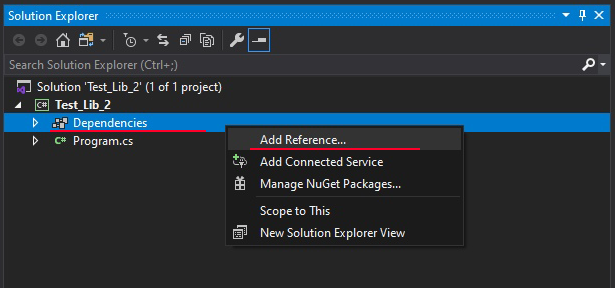
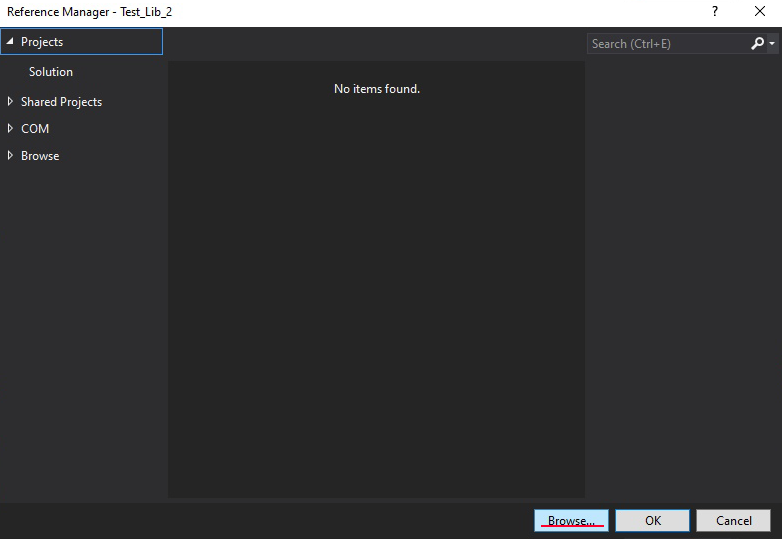
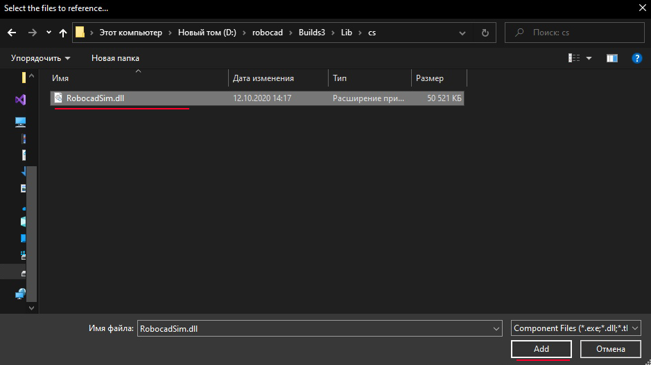

C# library
======================================

Here is some info about how to use robocadSim C# library in your project. I am going to use Visual Studio 2019.

1. You need emgu-cv installed in your project. `(How to install example). <https://www.youtube.com/watch?v=8PoonbKW7YI>`__  
2. Click on Your project name in **Solution explorer** -> right click on **Dependencies** -> **Add reference...**

3. Click on **Browse...**

4. Select **RobocadSim.dll** in **./Lib/cs/** and click **Add**

5. Now You can use robocadSim C# library in Your project!